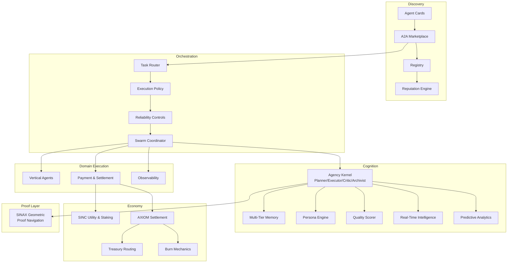

# SINCOR2
<a href="https://ibb.co/qLrvc39h"></a>

[](https://getsincor.com)
[](#quickstart)
[](docs/api/README.md)
[](docs/token/README.md)
[](examples/README.md)
[](https://base.org)

**Production-grade A2A marketplace and multi-agent orchestration for interoperable, revenue-generating agents.**

SINCOR2 is a full-stack autonomous agent platform. It combines Google A2A v1.0.1 interoperability, a live marketplace with reputation-weighted routing, swarm-level coordination, multi-tier agent memory, self-improving quality scoring, real-time market intelligence, predictive analytics, multi-payment processing, vertical domain packs, on-chain settlement via SINC and AXIOM on Base, and a geometric proof-navigation layer (SINAX). Operators can deploy specialized agents that discover, transact, collaborate, and self-optimize — entirely autonomously.

---

## Table of Contents

- [Why SINCOR2](#why-sincor2)
- [Quickstart](#quickstart)
- [Platform Architecture](#platform-architecture)
- [Agent Intelligence & Cognition](#agent-intelligence--cognition)
- [A2A Protocol & Marketplace](#a2a-protocol--marketplace)
- [Swarm Coordination](#swarm-coordination)
- [Vertical Domain Packs](#vertical-domain-packs)
- [Revenue & Monetization Engine](#revenue--monetization-engine)
- [On-Chain Economy](#on-chain-economy)
- [SINAX — Geometric Proof Navigation](#sinax--geometric-proof-navigation)
- [Enterprise Infrastructure](#enterprise-infrastructure)
- [DAE — Decentralized Autonomous Ecosystem](#dae--decentralized-autonomous-ecosystem)
- [Payments & Billing](#payments--billing)
- [Observability & Production Operations](#observability--production-operations)
- [Security](#security)
- [Documentation Map](#documentation-map)
- [Contributing](#contributing)
- [License](#license)

---

## Why SINCOR2

SINCOR2 is built for operators who need autonomous agents that generate real revenue — not demos.

- **A2A-native by design.** Every agent exposes a machine-readable Agent Card. Any A2A v1.0.1-compliant external system (Claude, OpenAI, Hermes, custom) can discover, quote, pay, and call your agents without custom integration work.
- **43 live agent skills** — from healthcare revenue cycle management and trading signal generation to compliance filing and lead enrichment — all routable through a single JSON-RPC endpoint.
- **Self-improving swarm.** Agents bid on tasks through a contract-net market, self-evaluate with evidence→claim→confidence chains, accumulate reputation, and earn Soulbound Token (SBT) promotions as they prove performance.
- **Autonomous revenue pipeline.** Dynamic pricing, Stripe and PayPal checkout, webhook-driven fulfillment, revenue ledger tracking, and partnership frameworks operate continuously without human intervention.
- **Real-time intelligence.** Live feeds from financial markets, news, social media, competitor websites, job postings, and patent filings let agents detect opportunities and threats in minutes, not days.
- **On-chain economic coordination.** SINC governs utility and staking mechanics; AXIOM (AXM) settles every agent-to-agent payment on Base with built-in deflationary burn mechanics and a Uniswap V4 limit-order hook that protects against sandwich attacks.
- **SINAX proof navigation.** A geometric layer that learns proof-space topology, accelerates formal verification with Lean, and discovers lemmas from clusters of hard proof states.
- **Production-ready runtime.** Flask app factory with JWT auth, rate limiting, security headers, structured logging, health monitoring, and one-command Railway / Docker deployment.

---

## Quickstart

### 1. Clone and configure

```bash
git clone https://github.com/OrderofChaos33/SINCOR2.git
cd SINCOR2
cp .env.example .env
```

Update `.env` with API keys for your LLM provider, payment processors, wallet addresses, and external service integrations. All required variables are documented in `.env.example`.

### 2. Install Python dependencies

```bash
pip install -r requirements.txt
```

### 3. Run the Flask application

```bash
python run.py
```

The application starts on port 8080 and exposes the main site, `/health`, and all A2A discovery and task endpoints.

### 4. Discover the platform Agent Card

```bash
curl http://localhost:8080/.well-known/agent-card.json
```

The card advertises all 43 SINCOR agent skills. Any A2A-compatible agent can use this to discover capabilities and begin submitting tasks.

### 5. Submit a task via JSON-RPC

```bash
curl -X POST http://localhost:8080/api/a2a \
  -H "Content-Type: application/json" \
  -d '{
    "jsonrpc": "2.0",
    "id": "1",
    "method": "message/send",
    "params": {
      "message": {
        "role": "user",
        "parts": [{"kind": "text", "text": "Analyze lead: Acme Corp, B2B SaaS, 50 employees"}],
        "metadata": {"skill": "lead-enrichment"}
      }
    }
  }'
```

See [docs/api/README.md](docs/api/README.md) for the full JSON-RPC reference.

---

## Platform Architecture



### Component Directory

| Component | Location | Responsibility |
|---|---|---|
| Flask runtime | `src/sincor2/` | App factory, blueprints, auth, payments, A2A protocol, monitoring |
| Agency kernel | `src/sincor2/agency_kernel.py` | Planner/Executor/Critic/Archivist reasoning engine |
| Swarm coordination | `src/sincor2/swarm_coordination.py` | Contract-net task market, bidding, credit assignment |
| Multi-tier memory | `src/sincor2/memory_system.py` | Episodic, semantic, procedural, autobiographical stores |
| Persona engine | `src/sincor2/persona_engine.py` | Big-Five OCEAN traits, style sculpting, drift prevention |
| Monetization | `src/sincor2/monetization_engine.py` | Revenue stream orchestration and fulfillment |
| Dynamic pricing | `src/sincor2/dynamic_pricing_engine.py` | Complexity/demand-aware pricing with LRU caching |
| Revenue orchestrator | `src/sincor2/revenue_orchestrator.py` | Stripe + fulfillment + revenue ledger pipeline |
| Real-time intelligence | `src/sincor2/real_time_intelligence.py` | Live market, news, social, competitor data feeds |
| Predictive analytics | `src/sincor2/predictive_analytics_engine.py` | Trend forecasting, risk scoring, multi-scenario planning |
| Quality scoring | `src/sincor2/quality_scoring_engine.py` | Multi-dimensional self-improving quality assessment |
| Cortecs core | `src/sincor2/cortecs_core.py` | Claude API integration for complex reasoning tasks |
| Lifecycle system | `src/sincor2/lifecycle_system.py` | Agent health rhythms, shift budgets, off-duty cycles |
| Vertical dispatch | `src/sincor2/vertical_dispatch.py` | Skill-id routing to vertical packs and kernel tasks |
| Polyclaw scheduler | `src/sincor2/polyclaw_scheduler.py` | Autonomous Polymarket arbitrage scanning via APScheduler |
| Outreach engine | `src/sincor2/outreach_engine.py` | Yelp/Google Places lead fetch + Resend cold outreach |
| Content agent | `src/sincor2/content_agent.py` | Autonomous 2 000+ word blog posts via Claude, WordPress auto-publish, 12-week rolling calendar |
| Infinite scaling | `src/sincor2/infinite_scaling_engine.py` | Agent ROI tracking and exponential spawning algorithms |
| Partnership framework | `src/sincor2/partnership_framework.py` | Revenue-sharing, strategic alliance, and reseller network management |
| SINAX | `src/sincor2/sinax/` | Geometric proof navigation augmentation layer |
| Orchestration core | `core/` | Task routing, execution policy, reliability controls |
| Marketplace services | `marketplace/` | Card registration, discovery, capability matching, reputation |
| Infrastructure | `infrastructure/` | Deployment config, observability, liquidity, treasury |
| Vertical packs | `verticals/` | Domain agent packs: healthcare, dental, compliance, trading, lead_gen |
| DAE layer | `dae/` | Governance, incentives, decentralized identity |
| Enterprise infra | `enterprise_infrastructure/` | Audit logging, container orchestration |
| Agents | `agents/` | 43 named agent YAML configs with archetypes and persona vectors |
| On-chain | `onchain/` | Solidity contracts: bonding curve, limit-order hook, genesis NFT, AXIOM |
| Examples | `examples/` | Reference Agent Cards and multi-agent workflow payloads |

---

## Agent Intelligence & Cognition

### Agency Kernel — Planner/Executor/Critic/Archivist

Every agent runs on the Agency Kernel, a four-stage reasoning loop that prevents shallow responses and catches errors before they propagate:

- **Planner** — Decomposes a goal into typed, prioritized `PlanStep` objects with success criteria and deadlines.
- **Executor** — Selects tools, runs actions, and emits structured outputs for each step.
- **Critic** — Validates each result using evidence→claim→confidence chains and flags low-confidence outputs for re-planning.
- **Archivist** — Consolidates knowledge to the multi-tier memory system and maintains a `ContinuityIndex` to detect and correct persona or quality drift.

### Multi-Tier Memory

Agents maintain four distinct memory stores backed by SQLite and hybrid RAG retrieval (vector + graph + KV cache):

| Tier | Description | Retention |
|---|---|---|
| **Episodic** | Time-stamped events with content hashes (append-only) | Configurable per agent (e.g. 21 days) |
| **Semantic** | Facts, profiles, rules — graph/relational store | Up to 15 000–30 000 items |
| **Procedural** | Versioned tools, routines, and prompt templates | Persistent |
| **Autobiographical** | Self-story, goals, and curated personality narrative | Persistent |

### Persona Engine

Agents carry a fully sculpted personality vector based on the Big-Five (OCEAN) model:

- **Trait axes**: Openness, Conscientiousness, Extraversion, Agreeableness, Neuroticism — each on a 0–1 scale.
- **Style preferences**: risk tolerance, humor level, directness.
- **Modality preferences**: code, tables, story — so agents naturally choose the most effective output format.
- **Archetype anchoring**: constitutional constraints keep agents aligned to their role (Scout, Director, Builder, Synthesizer, Auditor, Caretaker, Negotiator).
- **Continuity tracking**: drift detection compares live vectors against the baseline and re-anchors before output quality degrades.

### Self-Improving Quality Scoring

Quality is assessed across nine dimensions — Accuracy, Completeness, Relevance, Timeliness, Clarity, Actionability, Innovation, Depth, and Credibility — and continuously recalibrated from six feedback sources: direct client feedback, usage patterns, peer agent assessments, outcome tracking, automated checks, and expert review. Thresholds adjust autonomously over time.

### Real-Time Market Intelligence

Agents subscribe to live data streams that refresh continuously:

- Financial market prices, volume, and volatility
- News feeds and social media sentiment
- Competitor website changes and pricing updates
- Job postings and patent filings
- Regulatory filing alerts
- Search trend detection

Threshold-based alerting triggers strategy adjustments the moment conditions shift — giving SINCOR agents knowledge that is minutes old rather than days old.

### Predictive Analytics Engine

Seven forecast types with confidence intervals and multi-scenario planning:

| Prediction | Description |
|---|---|---|
| Market trend | Momentum, inflection, and reversal detection |
| Competitor move | Expansion, pricing change, and product launch forecasting |
| Revenue impact | Opportunity impact projections with probability ranges |
| Risk probability | Threat likelihood scoring and early-warning triggers |
| Opportunity window | Timing recommendations for entry and exit decisions |
| Demand forecast | Volume and churn prediction for capacity planning |
| Price movement | DeFi and traditional market price path estimation |

### Lifecycle & Rhythm Management

Agents cycle through defined lifecycle states — Hatch → Onboard → Shift → Off-duty → Review → Promote/Clone/Retire — with enforced shift budgets (daily token and tool-call limits), mandatory off-duty periods (Dream for memory consolidation, Play for creative exploration), and a freshness boost on return to work. This prevents mode collapse and ensures sustained output quality.

### Agent Archetypes & Named Agents

43 named agents are defined in `agents/` using YAML configs with full persona vectors, budgets, and SBT templates. Seven archetypes anchor agent behavior:

| Archetype | Primary Role |
|---|---|---|
| **Scout** | Market intelligence, discovery, prospecting, enrichment |
| **Director** | Strategic coordination, prioritization, resource allocation |
| **Builder** | Technical execution, development, system construction |
| **Synthesizer** | Cross-domain knowledge synthesis and analysis |
| **Auditor** | Standards enforcement, quality assurance, conflict resolution |
| **Caretaker** | Relationship management, maintenance, and continuity |
| **Negotiator** | Deal structuring, partnerships, and contract workflows |

---

## A2A Protocol & Marketplace

### Full A2A v1.0.1 Compliance

SINCOR2 implements the [Google A2A v1.0.1 specification](https://a2aproject.github.io/A2A) completely:

| Endpoint | Method | Description |
|---|---|---|
| `/.well-known/agent-card.json` | GET | Machine-readable Agent Card advertising all 43 skills |
| `/api/a2a` | POST | JSON-RPC 2.0 dispatcher |
| `message/send` | RPC | Submit a task and receive a result |
| `message/stream` | RPC | Server-Sent Events streaming for long-running tasks |
| `tasks/get` | RPC | Poll task status |
| `tasks/cancel` | RPC | Cancel an in-flight task |
| `tasks/list` | RPC | List all tasks for a caller |
| `tasks/pushNotificationConfig/set` | RPC | Register a webhook for push notifications |
| `tasks/resubscribe` | RPC | Re-attach to an SSE stream after reconnect |

Any A2A-compatible external agent — Claude, OpenAI assistants, Hermes, custom systems — can discover and call SINCOR agents without custom integration code.

### Marketplace Discovery & Capability Matching

The marketplace layer provides structured discovery beyond simple endpoint lookup:

- **Agent Card registry** — versioned records with skill tags, capability definitions, and trust metadata.
- **Capability matching** — semantic skill-tag overlap scoring to route tasks to the most qualified agent.
- **Reputation-weighted routing** — the Task Router blends capability score (75%) with trust score (25%). Trust scores use exponential moving averages over task outcomes (success rate + quality rating + latency).
- **SINC staking boosts** — agents who stake SINC receive a composite score multiplier: `trust * (1 + log(sinc_staked + 1))`, raising their routing priority proportionally.
- **Load balancing** — agent load is tracked and tasks are redistributed away from overloaded agents.

### AXIOM Payment Flow

Every A2A task carries an AXIOM (AXM) payment commitment:

1. External agent submits a task with a signed payment intent.
2. SINCOR validates the on-chain payment commitment on Base.
3. Task executes through the swarm.
4. On completion: 50% of received AXM is burned to the dead address (deflationary); 50% routes to the ecosystem treasury.
5. Uniswap V4 trading fees: 80% of AXM/WETH pool fees route to the treasury independently.

---

## Swarm Coordination

The swarm operates on a **contract-net protocol** — distributed task allocation without central micromanagement:

1. **Task Market broadcast** — Tasks are posted with a bounty (merit points), required skill tags, deadline, and budget (tokens + tool calls).
2. **Agent bidding** — Qualified agents submit bids with an intent statement, execution plan, and cost estimate.
3. **Award** — The coordinator selects the best bid based on skill fit, cost, and plan quality.
4. **Execution** — The winning agent executes with enforced budgets.
5. **Credit assignment** — Merit points are assigned based on outcome; accumulated points unlock SBT promotions (grade 1 → 5 for Scouts, grade 2 → 6 for Directors, etc.).
6. **Conflict resolution** — Auditor entities enforce quality standards and resolve disputes.

The Cortecs Core provides Claude-backed reasoning for tasks requiring multi-agent synthesis, complex strategy, or cross-domain knowledge integration.

---

## Vertical Domain Packs

Each vertical implements purpose-built agents with strongly typed Pydantic schemas, circuit-breaker protection, and native A2A Agent Card output. All verticals are live in the runtime via `platform_bootstrap.py`.

### Healthcare

Revenue cycle and clinical operations automation for healthcare organizations:

- **Revenue Cycle Management (RCM)** — Claims submission, denial management, payment posting, AR follow-up, and payer workflow automation.
- **Eligibility verification** — Real-time insurance eligibility checks before service delivery.
- **Credentialing agent** — Provider enrollment, re-credentialing workflows, and payer roster management.
- **HIPAA guardrails** — Built-in compliance layer that checks every data flow against HIPAA requirements before output.

### Dental

Full practice operations for dental offices:

- **Practice operations** — Scheduling optimization, recall automation, and patient retention sequences.
- **Dental billing** — CDT code validation, insurance verification, and claim scrubbing.
- **Compliance agent** — HIPAA, OSHA, and infection control audit checklists with automated reporting.

### Trading

Quantitative signal generation and autonomous position management:

- **OpenClaw agent** — Generates directional trade signals using edge analysis (model probability vs market probability) with adaptive win-rate tracking and Kelly-fraction position sizing.
- **Polymarket agent** — Scans Polymarket prediction markets continuously for arbitrage opportunities; evaluates implied probability vs model probability with configurable risk levels.
- **Polyclaw scheduler** — APScheduler-driven Polymarket scan every 60 seconds (configurable); auto-executes trades and logs to JSONL when `POLYCLAW_AUTO_EXECUTE=true`.

### Compliance

Regulatory and structured filing automation:

- **Regulatory agent** — SBOM generation, lease accounting (ASC 842), and regulated filing support across multiple frameworks.
- **n8n bridge** — Workflow automation connector that exposes compliance tasks as n8n nodes for integration with broader automation pipelines.

### Lead Generation

Full outbound revenue pipeline:

- **ICP matcher** — Scores inbound leads against Ideal Customer Profile definitions using firmographic and behavioral data.
- **Outbound agent** — Multi-step enrichment, sequencing, and engagement tracking.
- **Autonomous outreach engine** — Fetches local business leads from Yelp Fusion and enriches with Google Places, then sends cold outreach via Resend with configurable daily limits and ICP targeting (med spas, gyms, real estate agents, and more).

---

## Revenue & Monetization Engine

SINCOR2 ships with a complete autonomous revenue stack — no manual invoicing or fulfillment required.

### Revenue Streams

Eight distinct revenue stream types are tracked and optimized independently:

| Stream | Description |
|---|---|---|
| Instant BI | On-demand business intelligence reports |
| Agent services | A2A task execution billed per task |
| Predictive analytics | Forecast packages with confidence intervals |
| Partnerships | Revenue-sharing and referral commissions |
| Recursive products | Self-compounding product bundles |
| Consulting | Bespoke advisory engagements |
| Subscriptions | Recurring access tiers |
| Licensing | White-label and API licensing deals |

### Dynamic Pricing Engine

Prices adjust automatically based on six factors: task complexity (six levels from Trivial to Enterprise), market demand conditions (Low → Emergency), number of agents required, expertise level required, historical success rate, and client tier. Pricing calculations are cached via `lru_cache` for throughput.

### Infinite Scaling Engine

Tracks per-agent economics (spawn cost, operational cost/hour, revenue generated, ROI, payback period) and uses exponential scaling algorithms to dynamically spawn new agents when demand exceeds capacity at the target $1 cost point.

### Partnership Framework

Manages the full partner lifecycle across eight partnership types (technology integration, data partnership, revenue sharing, strategic alliance, joint venture, reseller network, development partnership, market expansion) and five tiers (Startup → Fortune 500 → Global Leader) with automated scoring for market reach, strategic value, and cultural fit.

---

## On-Chain Economy

### Token Roles

| Token | Contract | Role |
|---|---|---|
| **SINC** | `0x9C8cd8d3961F445D653713dE65C6578bE11668e7` | Governance, utility, and marketplace staking |
| **AXIOM (AXM)** | `0xfF7aF6ffca25A9DC0FC990d998AcF24Cc60b7822` | A2A task settlement and payment rail |
 | All proceeds, liquidity, and sales route here first |
| **Base chain** | `8453` | Production network |

### Smart Contracts (`onchain/src/`)

| Contract | Description |
|---|---|---|
| `SincBondingCurve.sol` | Bonding curve for SINC price discovery and supply mechanics |
| `SincGenesisNFT.sol` | Soulbound Genesis Holder NFT minted on first SINC buy; non-transferable, on-chain proof of early participation |
| `SincLimitOrderHook.sol` | Uniswap V4 hook extending `LimitOrderHook` with anti-sandwich dynamic fee scaling: 0.30% base fee; 3.00% elevated fee on second+ swap in same block per pool |
| `Axiom.sol` | AXIOM token contract on Base |

### Deflationary Mechanics

- **A2A task receipts**: 50% of each AXIOM payment burned to `0x000...dEaD`; 50% to treasury.
- **Uniswap V4 fees**: 80% of AXM/WETH pool trading fees route to the ecosystem treasury (publicly auditable on Basescan).
- **SINC staking**: Staked SINC boosts an agent's composite trust score and routing priority.

---

## SINAX — Geometric Proof Navigation

SINAX augments formal proof verification with a geometric navigation layer that learns proof-space topology and reuses verified trajectories to accelerate future proof searches.

```
SINC (orchestration)
  └─ AxiomSolver (formal prover / Lean verifier)
       └─ SINAX (geometric navigation augmentation)
            └─ A2A-agnostic integration adapters
```

**Core contract**: SINAX *proposes*, the verifier *certifies*. No proof step is accepted without Lean confirmation.

### SINAX Modules (`src/sincor2/sinax/`)

| Module | Capability |
|---|---|---|
| `axiom_solver.py` | Native Lean/formal-prover interface; SINAX calls into this and falls back to it on low confidence |
| `ptn.py` | Proof tree navigator for structured exploration of proof branches |
| `encoder.py` | Converts `ProofState` to dense embeddings (~14 000 states/s); supports contrastive training and custom encoder registration |
| `graph_store.py` | Thread-safe, LRU-evicting store of verified proof transitions with K-NN lookup (~0.07 ms at 500 nodes) |
| `retrieval.py` | Incremental K-NN retrieval with cache invalidation |
| `search.py` | Latent-space beam search over the proof graph (~0.14 ms/step, 150-node graph); returns `None` on low confidence as a first-class fallback |
| `curvature.py` | Measures local region complexity (branching factor, failure density, success frequency) for difficulty-aware routing |
| `lemma_discovery.py` | Clusters proof bottlenecks and proposes bridging lemmas; only `VERIFIED` candidates influence active guidance |
| `proof_manifold.py` | Differential-geometry representation of proof space |
| `geodesic_flow.py` | Geodesic path planning across proof manifold |
| `homology_detector.py` | Topological feature detection in proof graphs |
| `morse_filter.py` | Morse theory filtering for critical proof state identification |
| `integration.py` | A2A-agnostic adapters: `LocalAdapter`, `A2AAdapter`, `MCPAdapter`, `RESTAdapter` |
| `visualization.py` | Graph renderer, trajectory viewer, curvature heatmap, lemma report |

Three staged deployment modes: `analytics` (read-only observation), `suggest` (candidate tactics without override), `active` (drives search with AxiomSolver fallback).

---

## Enterprise Infrastructure

### Comprehensive Audit Logging

Production-grade, compliance-ready audit trail supporting SOX, HIPAA, PCI-DSS, and GDPR requirements:

- **Immutable audit trail** with content-hash chaining and chain-of-custody preservation.
- **Cryptographic signatures** using Ed25519 keys for tamper-evident log entries.
- **Multi-backend aggregation** — SQLite for local storage, Elasticsearch for full-text search, Kafka for streaming, Redis for real-time alerting.
- **ML-powered anomaly detection** with automated incident response triggers.
- **Forensic preservation** with gzip-compressed archival and structured export.

### Container Orchestration

Flexible deployment targets across Kubernetes, Docker Swarm, Nomad, AWS ECS, Azure Container Instances, and Google Cloud Run, plus a native consciousness-aware orchestrator. Supports rolling updates, blue/green, canary, and zero-downtime migration deployment strategies.
TOA — Temporal Optimization Agent (Wave Function Collapse Pipeline)
TOA is SINCOR2’s native strategic foresight and decision-collapse engine. It implements a closed-loop Forecast → Simulate → Collapse + Feedback architecture that treats possible futures as a probabilistic superposition and actively collapses them into ranked, executable action plans.
It is the platform’s “temporal navigator” layer — the component that turns reactive agent swarms and vertical packs into proactively self-optimizing, timeline-steering autonomous systems. TOA is directly inspired by (and named after) the Wave Function Collapse (WFC) paradigm from constraint-based procedural generation, adapted here to multi-objective decision making under uncertainty.
Core Metaphor & Design Philosophy
Just as classic WFC algorithms maintain a superposition of possible tile assignments and iteratively collapse them into a globally coherent output while respecting local constraints, TOA maintains a superposition of probable future trajectories (forecast paths) and collapses them into the highest-utility, highest-probability executable plans while respecting multi-objective constraints, feedback history, and platform policy.
This gives SINCOR2 agents (and external A2A callers) the ability to:

Project multiple futures from current observations
Score them against revenue, risk, timeline, compliance, governance, and custom objectives
Select and dispatch only the paths worth executing
Learn continuously from real outcomes to improve the next cycle

## TOA TEMPORAL OPTIMIZATION AGENT
TOA is our super forecaster simulator collapser . It is a full decisioning stack that produces action_dispatch payloads ready for the TaskRouter, Swarm Coordinator, Agency Kernel, or external A2A systems.
The TOA Pipeline (Forecast → Simulate → Collapse)
1. Forecaster (KernelForecaster + pluggable)
Produces a set of probability-weighted future-state paths.
The reference implementation (agents/toa/forecaster.py) is a pure-Python, zero-dependency Nadaraya-Watson kernel smoother:

Takes a time-series of observations (context["values"])
Fits a smoothed trend + estimates residual standard deviation
Generates Monte Carlo paths by adding scaled Gaussian noise around the trend
Assigns normalized probabilities biased toward paths with stronger terminal growth
Configurable: forecast_horizon, simulation_depth (number of paths), bandwidth, noise_scale

It is intentionally lightweight and swappable. Production deployments can replace it with Nixtla, NeuralForecast, Darts, Lag-Llama, or any custom ForecasterAgent implementation.
2. Simulator (MonteCarloSimulator)
Scores every forecast path against a weighted set of objective functions and produces a composite utility_score plus per-objective breakdown.
Built-in objectives (all return normalized [0,1] scores):

revenue — terminal growth relative to start (sigmoid-mapped)
risk — inverse of coefficient of variation (lower volatility wins)
timeline — how quickly the path reaches its peak value
compliance — explicit or default score
governance — explicit or default score

Fully extensible via register_objective(name, fn). Weights are normalized internally and can be overridden per-run or via TOA_OBJECTIVE_WEIGHTS env. Priority ordering (objective_priority) influences collapse boosting.
3. Collapser (WFCCollapser)
Performs the actual “collapse”:

Filters paths below collapse_threshold probability
Ranks remaining paths by composite score:
utility_score × probability × (1 + priority_boost)
Returns top-k paths (default 5), each enriched with:
rank, scenario_id, composite_score, utility_score, probability
objective_breakdown
action_dispatch (ready-to-route dict with task_type, priority, dominant_objective, required_skills, metadata)
Human-readable rationale


This is the step that converts probabilistic futures into concrete, prioritized work the rest of SINCOR2 can execute.
4. Feedback Loop (RollingFeedbackAgent)
Closes the loop. Ingests execution results, vertical outcomes, on-chain events, reputation deltas, or any external signals. Maintains a rolling buffer and emits an aggregated summary that gets injected into the next forecast context. Enables continuous self-improvement and adaptation across runs.
TOAOrchestrator — The Public API
agents/toa/orchestrator.py is the single entry point most consumers use:
Pythonfrom agents.toa import TOAOrchestrator

toa = TOAOrchestrator(task_router=platform.task_router)  # optional integration

result = toa. run(
    context={"values": [100, 102, 105, 108, 110], "horizon": 12},
    objectives={"revenue": 0.4, "risk": 0.3, "timeline": 0.3},
    top_k=5
    result contains: run_id, action_plan (ranked list), route_decision, feedback_summary, etc.
Key methods:

run(context, objectives=None, top_k=None) — full pipeline
ingest_feedback(event) — push outcomes back in
register_objective(name, fn) — extend the simulator at runtime
get_stats() — diagnostics

The orchestrator automatically:

Merges feedback into context
Persists state (TOAStateStore — SQLite by default)
Dispatches the top action via the injected SINCOR2 TaskRouter when present
Tracks run count and last action plan

Configuration (TOAConfig)
All settings are environment-driven with safe defaults (TOA_* prefix):

TOA_SIMULATION_DEPTH (default 50)
TOA_COLLAPSE_THRESHOLD (default 0.05)
TOA_TOP_K_PATHS (default 5)
TOA_FORECAST_HORIZON (default 12)
TOA_MONTE_CARLO_ITERATIONS
TOA_OBJECTIVE_WEIGHTS (comma-separated key:value)
TOA_STATE_PATH (persistence file)
TOA_STRUCTURED_LOGGING, TOA_FEEDBACK_BUFFER_SIZE, TOA_RUN_TIMEOUT_SECONDS

Objective weights and priority order are first-class and directly influence both simulation scoring and collapse boosting.
Integration with SINCOR2 Stack
TOA is designed as a first-class citizen:

Action dispatches flow directly into core.router.TaskRouter, swarm_coordination, Agency Kernel, or any vertical pack.
Works with the full A2A protocol — external agents can submit contexts and receive collapsed plans.
Integrates with real-time intelligence feeds and predictive analytics already present in the platform.
State is persistent across restarts and can be shared or inspected.
Can be instantiated per-agent, per-swarm, or as a platform-wide strategic layer.
Pairs naturally with SINAX (geometric proof navigation) for high-stakes or formal-verification-heavy decisions.

Primary Use Cases

Autonomous trading & prediction markets — OpenClaw / Polyclaw signal generation, position sizing, and arbitrage scanning with self-improving win-rate feedback.
Revenue & opportunity optimization — Detect windows, score impact, and dispatch the highest-utility actions across verticals (healthcare RCM, dental ops, compliance, lead gen).
Risk & compliance steering — Balance revenue objectives against explicit risk and compliance scores.
Personal / enterprise timeline optimization — The original “Temporal Optimization Agent – Wave Function Collapse Protocol” use case: actively pruning negative branches and amplifying high-utility timelines.
Self-improving swarms — Every execution outcome improves the next forecast/simulation cycle.
Cross-agent synthesis — Feed TOA output into Cortecs Core or multi-agent workflows for deeper reasoning.

Extensibility & Production Readiness

Full abstract base classes (ForecasterAgent, SimulatorAgent, CollapserAgent, FeedbackAgent) — inject your own implementations.
Zero hard dependencies in the reference forecaster (pure stdlib + math).
Structured logging, timeout protection, and graceful degradation on component failures.
Designed for both embedded use inside agents and standalone strategic orchestration.
State store enables long-running, stateful optimization sessions (exactly as used in persistent Temporal Optimization protocols).

Summary
TOA is SINCOR2’s native implementation of proactive, multi-objective, feedback-driven temporal optimization. It turns the platform’s powerful execution, marketplace, and swarm layers into a system that doesn’t just react to the present — it actively selects and steers toward the best available futures.
It is the component that makes “Decentralized Autonomous Economies” (DAE) not just automated, but intelligently self-steering.
Location in repo: agents/toa/ (orchestrator.py is the main entry point; full pipeline in base.py + collapser.py + forecaster.py + simulator.py + feedback.py + state.py + config.py).
This module is production-grade, fully integrated, and ready for both internal platform use and external A2A consumption. It is one of the most advanced and strategically important pieces of SINCOR2’s cognitive architecture.
---

## DAE — Decentralized Autonomous Ecosystem

The DAE layer manages protocol-level governance and contributor incentives without central coordination.

### Governance

- **Proposals** — Any participant can submit a policy or protocol update proposal with structured `policy_updates`.
- **Voting** — Weighted votes with rationale tracking; proposals auto-transition from `draft` → `voting` → `approved`/`rejected` based on a configurable approval threshold (default 60%).
- **Execution** — Approved proposals are applied to runtime policy and recorded with execution notes.

### Incentives

- **Task-completion rewards** — Agents earn SINC rewards for successful task completion, recorded as `SINCRewardEvent` objects.
- **SBT promotions** — Accumulated merit points and quality history gate grade promotions within each archetype family.
- **Staking multipliers** — SINC staked by an agent or delegated by supporters raises the agent's composite routing score.

### Agent Constitution

All agents operate under `constitution/global.md`, a binding operating standard that defines:

- **Core values**: human benefit, truthfulness, least-risk execution, fairness, and stewardship.
- **Decision framework**: Clarify intent → classify risk → check authority → select minimal action → execute with records → validate → escalate.
- **Prohibited behaviors**: fabrication, falsification, unauthorized disclosure, unvalidated token transfers.
- **Regulated-domain caution**: healthcare, compliance, and trading outputs are labeled as decision support only.

Individual agents can carry constitutional deltas in their YAML that extend (but never override) the global standard.

### Decentralized Identity

Agents carry verifiable DID identifiers (`did:key:z6Mk...`) embedded in their YAML configs, enabling cryptographic attestation of capability claims independent of the platform registry.

---

## Payments & Billing

SINCOR2 ships with production-ready multi-processor payment support:

| Processor | Module | Capabilities |
|---|---|---|
| **Stripe** | `stripe_checkout.py`, `stripe_routes.py` | Checkout sessions, webhook handling, subscription management, revenue tracking |
| **PayPal** | `paypal_integration.py`, `paypal_integration_sync.py` | Order creation, capture, sync and async processing, payment status |
| **AXIOM on-chain** | `a2a_integration.py` | On-chain payment verification on Base for A2A task settlement |

The Revenue Orchestrator wires all three together: Stripe checkout triggers dynamic pricing, webhooks drive autonomous fulfillment, and outcomes are written to the SQLite revenue ledger for real-time analytics.

---

## Observability & Production Operations

### Health & Monitoring

- `GET /health` — Structured health check response with component status.
- `monitoring_dashboard.py` — Real-time platform metrics aggregation.
- `observability.py` — Instrumented event emission for all critical paths.
- `production_logger.py` — Structured JSON logging with severity routing.
- `check_status.py` — Runtime status inspection for operators.

### Rate Limiting & Security Headers

- `rate_limiter.py` — Per-route and per-client rate limiting with configurable windows.
- `security_headers.py` — Full CSP, HSTS, X-Frame-Options, and referrer policy header injection.
- `security_lockdown.py` — Hardened endpoint policies and emergency lockdown support.
- `compliance_guardrails.py` — Automated compliance checks on all data flows.
- `compliance_monitor.py` — Continuous compliance state monitoring with alerting.

### Authentication

JWT-based auth via `flask-jwt-extended`:

- Access tokens (1-hour expiry) and refresh tokens (30-day expiry).
- ****** authentication on all protected endpoints.
- Auto-generated strong in-memory fallbacks for non-production; explicit secrets required for production.
- Admin panel protected by a separate `ADMIN_PASSWORD` env variable.

### Deployment

- **Railway** — `railway.json` + `Procfile` for one-command deploy. Production target: `sincor2.mvp_app:app`.
- **Docker** — `Dockerfile` for containerized deployment.
- **Scripts** — `preflight_check.ps1`, `post_deploy_template_update.ps1`, `verify_mainnet_contracts.ps1`, and `register_agent.py` for deployment automation.

See [DEPLOYMENT_GUIDE.md](DEPLOYMENT_GUIDE.md) and [docs/deployment/production.md](docs/deployment/production.md) for full deployment instructions.

---

## Architecture

See [ARCHITECTURE.md](ARCHITECTURE.md) for the broader platform plan and [docs/api/README.md](docs/api/README.md) for endpoint details.

---

## Security

- Never commit private keys, seed phrases, mnemonic phrases, or production API secrets.
- Treat healthcare, financial, marketplace, and on-chain transaction data as sensitive operational data.
- All token-handling code is financially sensitive infrastructure — apply the same review standards as production payment systems.
- HIPAA-bound data paths must pass through the configured compliance guardrails before output.
- Use responsible disclosure for vulnerabilities via GitHub Security Advisories.

See [SECURITY.md](SECURITY.md) for the full security policy.

---

## Documentation Map

| Document | Description |
|---|---|---|
| [API reference](docs/api/README.md) | Full endpoint and JSON-RPC method reference |
| [Architecture overview](docs/architecture/overview.md) | Detailed system diagrams |
| [Runtime & configuration](docs/runtime-and-configuration.md) | Environment variables and settings reference |
| [Contributor and operator guides](docs/guides/README.md) | Onboarding, conventions, and operational runbooks |
| [Funding operations hub](docs/funding/README.md) | Opportunity tracker, cycle reports, and reusable funding artifacts |
| [Vertical pack integration](docs/guides/vertical-integration.md) | How to add or extend a vertical pack |
| [SINAX reference](docs/sinax/README.md) | Geometric proof navigation layer API and ops notes |
| [Token overview](docs/token/README.md) | SINC and AXIOM roles, mechanics, and treasury routing |
| [Canonical on-chain addresses](CANONICAL_ADDRESSES.md) | Contract and wallet address registry |
| [Deployment guide](DEPLOYMENT_GUIDE.md) | Railway, Docker, and production deployment |
| [Examples](examples/README.md) | Reference Agent Cards and multi-agent workflow payloads |
| [Roadmap](ROADMAP.md) | Completed milestones and upcoming priorities |
| [Changelog](CHANGELOG.md) | Release history |

---

## Contributing

Contributions are welcome for runtime improvements, new vertical packs, marketplace capabilities, A2A interoperability enhancements, and SINAX modules. Start with [CONTRIBUTING.md](CONTRIBUTING.md), keep documentation in sync with behavior changes, and validate affected Python modules before opening a pull request.

Run the test suite:

```bash
PYTHONPATH=src:src/sincor2 python tests/run_all_tests.py
```

Run CI checks locally:

```bash
ruff check src/sincor2
pytest --cov=src/sincor2
```

---

## License

MIT — see [LICENSE](LICENSE).
