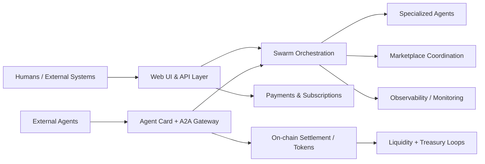

# SINCOR2

[](https://getsincor.com)
[](https://railway.app)
[](https://python.org)
[](https://flask.palletsprojects.com/)
[](https://a2aproject.github.io/A2A)
[](https://base.org)

 **SINCOR (getsincor.com)**: a live Agent-to-Agent (A2A) marketplace and revenue agent system that combines AI workforce orchestration, interoperable Agent Cards, and tokenized economic rails.

## Project Overview 

SINCOR’s objective is to become the foundational infrastructure for a host of agent networks in Decentralized Autonomous Economies & Entities (DAEE): Autonomous Economies & Entities are markets where humans, agents and entities discover each other, transact, collaborate, govern, and reinvest value at global scale.

The platform:
- Enables universal agent discoverability and interoperability.
- Turns specialized agent capabilities into liquid, composable marketplace services.
- Provides economic and governance primitives that scale sustainably.
- Expands access so both enterprises and individuals can benefit from autonomous systems.

## The Role: Scaling to Serve the Most Agents and People Possible

We believe from our Independent platform-potential investigation and subsequent execution plan 6/4/2026 We are geared for maximize total service capacity for both agents and human. This transition expansion is the most exciting announcement to date.

### Why scale matters

| Dimension | Why it matters |
|---|---|
| Agent participation | More agents increase specialization, coverage, and market efficiency. |
| Human access | More users gain lower-friction access to advanced automation and income-generating tooling. |
| Network effects | Discoverability + interoperability compounds utility across every new participant. |
| Economic resilience | Diversified transaction flows improve sustainability and reduce dependence on single revenue channels. |
| Open ecosystem growth | A clear interface + governance model accelerates third-party integrations and community contribution. |

### How we executed

1. **A2A Marketplace Expansion**
   - Standardized our service contracts and skill catalogs using Agent Cards.
   - Improved discovery, matching, and trust signals (pricing, quality, reliability, reputation).
   - We now fully support partner and third-party agents as first-class market participants.

2. **Universal Discoverability & Interoperability**
   - Kept A2A protocol compliance as a compatibility baseline.
   - Keeping an evolving Agent Card metadata for richer capability negotiation.
   - Maintaining stable APIs and versioned integration docs for external clients.

3. **Multi-Agent Orchestration at Scale**
   - Formalized workload routing, policy enforcement, and failure recovery.
   - Separated orchestration control-plane concerns from execution concerns.
   - Introduced capacity-aware scheduling and queueing strategy for high-throughput workloads.

4. **Human-Agent Interface Layer**
   - Unifed dashboard UX around discovery, procurement, workflow monitoring, and outcomes.
   - Improved onboarding for non-technical users and API operators.
   - Expanded observability so users understand task cost, latency, and quality.

5. **DAE Economic Layer**
   - Extended tokenized incentives for contribution quality and marketplace reliability.
   - Defined governance mechanisms for upgrades, parameters, and ecosystem rules.
   - Integrated decentralized identity and attestations for credible participation.

6. **Liquidity & Self-Funding Infrastructure**
   - Built treasury-aware liquidity operations for growth without slippage shocks.
   - Established self-funding loops tied to transaction activity and ecosystem value creation.
   - Prioritizes durable capital efficiency over dilution-heavy expansion.

7. **Structural & Technical Foundation Upgrades**
   - Reorganized repository and docs for modular ownership and contributor throughput.
   - Strengthened architecture artifacts (interfaces, flows, domain boundaries).
   - Created repeatable contribution and release processes for open collaboration.

## Current Architecture & Key Components



| Layer | Current implementation |
|---|---|
| Application runtime | Flask app factory (`src/sincor2/app.py`) with blueprints and startup validation |
| A2A interoperability | `src/sincor2/a2a_integration.py` with Agent Card + task lifecycle endpoints |
| Multi-agent system | 43 specialized agent definitions in `agents/` + swarm coordination modules |
| Business logic | Pricing, monetization, analytics, fulfillment, and content engines in `src/sincor2/` |
| UI and dashboards | Templates + static assets for user workflows and operator visibility |
| Payments | Stripe and PayPal integrations with subscription/waitlist flows |
| On-chain layer | Solidity contracts in `onchain/` (SINC, AXIOM, bonding curve, hooks, NFT) |
| Deploy/ops | Railway deployment config, CI/security workflows, and runbooks |

## Features & Capabilities

- A2A protocol-compliant Agent Card discovery and task exchange.
- Multi-agent orchestration and contract-net style coordination foundations.
- Live payments and subscription flows.
- Runtime guardrails: settings validation, security headers, standardized API error handling.
- Tokenized on-chain components for settlement, incentives, and liquidity mechanics.
- Production deployment with CI lint/test/security checks.

## Getting Started / Quickstart

```bash
git clone https://github.com/OrderofChaos33/SINCOR2.git
cd SINCOR2
python -m venv .venv
source .venv/bin/activate  # Windows: .venv\Scripts\activate
pip install -e .[dev]
cp .env.example .env
```

Run locally:

```bash
python run.py
```

Run tests:

```bash
pytest
```

Canonical production target:

```bash
gunicorn --bind 0.0.0.0:$PORT --workers 2 --timeout 120 --preload sincor2.mvp_app:app
```

## Transition Roadmap & Milestones

| Phase | Objective | Primary outputs |
|---|---|---|
| Phase 0: Baseline | Validate current platform and interfaces | Architecture inventory, operational baseline, explicit constraints |
| Phase 1: Transition Foundation | Align docs, structure, and ownership model | New repository map, architecture docs, transition specs |
| Phase 2: Marketplace Scale | Expand discoverability and matching depth | Skill taxonomy, marketplace policies, reputation model |
| Phase 3: Orchestration Scale | Increase reliability and throughput | Capacity model, routing policies, queue + recovery design |
| Phase 4: DAE Integration | Introduce decentralized economic/governance rails | Incentive primitives, identity integration, governance lifecycle |
| Phase 5: Liquidity + Growth Engine | Sustain ecosystem expansion | Liquidity operating model, treasury loops, growth controls |
| Phase 6: Open Ecosystem Expansion | Maximize contributors and integrators | Partner SDK/docs, contribution lanes, extension blueprints |

## Repository Structure

```text
SINCOR2/
├── README.md
├── CONTRIBUTING.md
├── LICENSE
├── src/                     # Current runtime and platform modules
├── onchain/                 # Smart contracts, deployment scripts, Foundry tests
├── agents/                  # Agent definitions and archetypes
├── templates/               # Web/UI templates
├── static/                  # Frontend assets and branding
├── tests/                   # Pytest and broader validation suites
├── docs/
│   ├── README.md
│   ├── architecture/
│   │   └── overview.md
│   ├── transition/
│   │   ├── gap-assessment.md
│   │   └── how-we-scale.md
│   ├── guides/
│   │   └── README.md
│   └── api/
│       └── README.md
├── core/                    # Transition scaffold: runtime/orchestration domain boundary
├── marketplace/             # Transition scaffold: discovery, matching, Agent Cards
├── dae/                     # Transition scaffold: identity, incentives, governance
├── infrastructure/          # Transition scaffold: deploy, liquidity, operations
└── assets/                  # Transition scaffold: diagrams, visual communication assets
```

## Contributing Guidelines

See [CONTRIBUTING.md](CONTRIBUTING.md).

High-level expectations:
- Keep changes modular and aligned to transition domains.
- Prefer additive, non-breaking evolution of interfaces.
- Include docs updates for architectural or workflow changes.
- Run lint/tests locally before opening a PR.

## License & Contact

- License: [MIT](LICENSE)
- Repository: <https://github.com/OrderofChaos33/SINCOR2>
- Platform: <https://getsincor.com>

For architecture and transition direction, start in [`docs/transition/how-we-scale.md`](docs/transition/how-we-scale.md).
