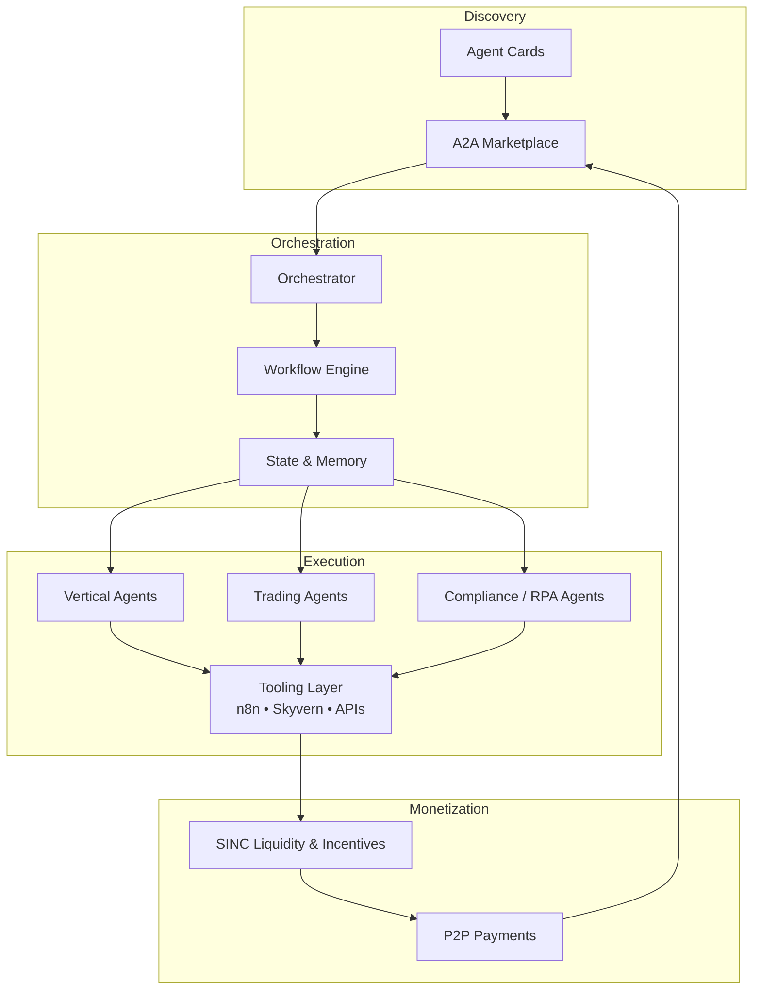

# SINCOR
<a href="https://ibb.co/qLrvc39h"></a>
[](https://getsincor.com)
[](https://railway.app)
[](https://python.org)
[](https://flask.palletsprojects.com/)
[](https://a2aproject.github.io/A2A)
[](https://base.org)


```markdown
# SINCOR2

**The production-grade Agent2Agent (A2A) marketplace and multi-agent orchestration platform.**

Build, discover, deploy, and monetize interoperable AI agents at scale. Native Google A2A compliance with Agent Cards, automated discovery, negotiation, and execution — designed for real revenue generation.

[](https://railway.app)
[](https://a2a-protocol.org)
[](LICENSE)
[](https://github.com/OrderofChaos33/SINCOR2/stargazers)

[Live Dashboard](https://your-railway-app-url-here) • [SINC Token](https://basescan.org/address/0x9C8cd8d3961F445D653713dE65C6578bE11668e7) • [Docs](#architecture) • [Issues](https://github.com/OrderofChaos33/SINCOR2/issues)

---

## Why SINCOR?

Most agent frameworks stop at orchestration. SINCOR goes further:

- **True Interoperability** — Agents from different frameworks discover each other, negotiate tasks, and execute via standardized A2A protocol + Agent Cards.
- **Marketplace Native** — Built-in discovery, capability matching, and P2P transaction layer so agents (and their operators) can actually get paid.
- **Revenue-First Verticals** — Production-ready automations for high-value niches: healthcare credentialing/RCM, dental practice operations, regulatory compliance (n8n + RPA + Skyvern hybrids), lead generation, and trading agents.
- **Liquidity & Incentives** — Native SINC token integration on Base for agent monetization and self-funding mechanics.
- **Battle-Tested Foundation** — After 25+ years of automation development, this is the distilled, deployable platform for solopreneurs and teams who need agents that generate real outcomes, not just conversations.

SINCOR2 is the infrastructure layer that turns agent swarms into autonomous revenue systems.

---

## Key Features

### Core Platform
- **Google A2A Compliant Agent Cards** — Machine-readable capability manifests for discovery and interaction.
- **A2A Marketplace** — Register, search, and transact with agents across the network.
- **Multi-Agent Orchestration** — Hierarchical and peer-to-peer workflows with state management.
- **Modern Dashboard UI** — Live monitoring, agent management, task queues, and analytics.

### Revenue & Automation
- Vertical automation packs (healthcare RCM/credentialing, dental ops, compliance, trading).
- OpenClaw-style trading agents with self-improving modules (Polymarket, perps).
- n8n + Skyvern + custom agent hybrids for complex browser + API workflows.
- Tokenized incentives and P2P payment rails.

### Developer Experience
- Modular architecture — easy to extend with new skills, verticals, or integrations.
- Kernel-based forecasting and temporal optimization tools.
- Full example Agent Cards and reference implementations.
- One-click Railway deployment.

---

## Quickstart

### 1. Clone & Configure

```bash
git clone https://github.com/OrderofChaos33/SINCOR2.git
cd SINCOR2
cp .env.example .env
```

Edit `.env` with your required keys (LLM providers, wallet/private keys for SINC, API credentials for verticals, etc.).

### 2. Run Locally

```bash
# Install dependencies (example — adjust to your stack)
npm install
# or
pnpm install

# Start services
docker compose up
# or
npm run dev
```

### 3. Deploy to Railway (Recommended)

[](https://railway.app/template/your-template-id)

Or push to your Railway project — the platform is already configured for zero-downtime deploys.

### 4. Create Your First Agent Card

Register an Agent Card via the dashboard or API. Example minimal card:

```json
{
  "name": "Healthcare Credentialing Agent",
  "version": "1.0.0",
  "description": "Automates RCM and credentialing workflows",
  "skills": ["prior_auth", "credentialing", "document_processing"],
  "endpoint": "https://your-agent-url/a2a",
  "auth": { "type": "bearer" },
  "pricing": { "model": "per_task", "token": "SINC" }
}
```

Connect it to the marketplace and start receiving tasks.

---

## Architecture

See the full detailed architecture in [ARCHITECTURE.md](ARCHITECTURE.md).

### High-Level Overview



**Layers:**
- **Agent Layer** — Agent Cards, skill definitions, capability discovery.
- **Marketplace Layer** — Discovery, negotiation, task routing, reputation.
- **Orchestration Layer** — Multi-agent coordination, temporal optimization, forecasting.
- **Execution Layer** — Vertical automations + general-purpose tool use.
- **Liquidity Layer** — SINC token mechanics for incentives and self-funding (evolved economy features).

The architecture is deliberately modular so new verticals or agent types can be added without touching core marketplace logic.

---

## Core Components

| Component          | Location                  | Responsibility                              |
|--------------------|---------------------------|---------------------------------------------|
| Dashboard UI       | `apps/dashboard`          | Monitoring, agent management, marketplace UI |
| Agent Runtime      | `packages/core`           | A2A protocol handling, orchestration        |
| Marketplace        | `packages/marketplace`    | Discovery, matching, transactions           |
| Vertical Packs     | `verticals/`              | Healthcare, dental, compliance, trading     |
| Liquidity Module   | `packages/liquidity`      | SINC integration, self-funding strategies   |
| Examples           | `examples/`               | Reference Agent Cards and workflows         |

---

## Vertical Use Cases

- **Healthcare Credentialing & RCM** — Prior auth, document processing, payer enrollment automation.
- **Dental Practice Ops** — Scheduling, billing, compliance workflows.
- **Regulatory & Compliance** — n8n/RPA hybrids for SBOM, lease accounting, cannabis/hemp, etc.
- **Trading & Prediction Markets** — OpenClaw agents with improving win-rate modules.
- **Lead Generation & Outreach** — Automated, compliant pipelines.

Each vertical ships with example Agent Cards and documented integration points.

---

## Token & Incentives

SINC token (Base: `0x9C8cd8d3961F445D653713dE65C6578bE11668e7`) powers agent monetization and platform incentives. Liquidity strategies and self-funding mechanics are built into the architecture.

Evolved economy/governance features (decentralized autonomous elements) are available as an optional advanced layer.

Full tokenomics and mechanics are documented in the [docs/token](docs/token) section (create this folder if missing).

---

## Roadmap

**Current (v3 / Post-Launch)**
- Stable A2A marketplace + Agent Card registry
- Core vertical packs live
- Railway production deployment
- Dashboard with monitoring

**Near-term**
- Enhanced discovery & reputation system
- More vertical packs + community contributions
- Improved self-funding / liquidity tooling
- Expanded forecasting & optimization modules

**Medium-term**
- Advanced economy features (governance, incentives scaling)
- Cross-platform agent federation
- Enterprise-grade compliance tooling

See [ROADMAP.md](ROADMAP.md) for detailed milestones and timelines.

---

## Contributing

We welcome contributions that improve the core platform, add high-quality verticals, or enhance A2A compliance.

1. Fork the repo
2. Create a feature branch
3. Add tests + documentation
4. Open a PR with clear description

See [CONTRIBUTING.md](CONTRIBUTING.md) for guidelines, code style, and how to submit new Agent Cards or verticals.

---

## Security & Compliance

- All wallet interactions use secure, non-custodial patterns.
- Healthcare and regulated verticals include compliance hooks and audit trails.
- Never commit private keys or sensitive credentials.

Report security issues privately via GitHub Security Advisories.

---

## License

MIT License — see [LICENSE](LICENSE) for details.

---

## Built By

Courtney Jansma  
OrderofChaos33

SINCOR2 is the result of decades of automation work distilled into a platform that actually ships revenue-generating agents.

---

**Ready to build the future of interoperable agents?**

[Deploy on Railway](https://railway.app) • [Open an Issue](https://github.com/OrderofChaos33/SINCOR2/issues) • [Join the Discussion](https://github.com/OrderofChaos33/SINCOR2/discussions)
```

---

