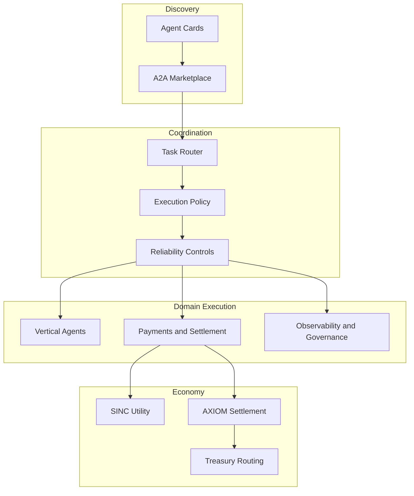

# SINCOR2
<a href="https://ibb.co/qLrvc39h"></a>

[](https://getsincor.com)
[](#quickstart)
[](docs/api/README.md)
[](docs/token/README.md)
[](examples/README.md)
[](https://base.org)

**Production-grade A2A marketplace and multi-agent orchestration for interoperable revenue-generating agents.**

SINCOR2 combines Google A2A v1.0.1 interoperability, marketplace discovery, multi-agent routing, and token-aware settlement on Base so operators can deploy specialized agents that discover, transact, and collaborate reliably.

## Why SINCOR2

- **A2A-native discovery** with machine-readable Agent Cards and JSON-RPC task handling.
- **Marketplace-first orchestration** for matching, routing, reputation, and settlement.
- **Vertical automation packs** for healthcare, dental, compliance, trading, and lead generation.
- **On-chain economic coordination** using SINC and AXIOM on Base with treasury-aware routing.
- **Production-minded Flask runtime** with monitoring, payments, auth, and deployment support.

## Quickstart

### 1. Clone and configure

```bash
git clone https://github.com/OrderofChaos33/SINCOR2.git
cd SINCOR2
cp .env.example .env
```

Update `.env` with the keys required for your environment, wallet flows, LLM providers, and external service integrations.

### 2. Install Python dependencies

```bash
pip install -r requirements.txt
```

### 3. Run the Flask application

```bash
python run.py
```

The application exposes the main site, operational endpoints such as `/health`, and the A2A discovery and task endpoints defined in `src/sincor2/a2a_integration.py`.

### 4. Discover the platform Agent Card

```bash
curl http://localhost:8080/.well-known/agent-card.json
```

## Architecture

See [ARCHITECTURE.md](ARCHITECTURE.md) for the broader platform plan and [docs/api/README.md](docs/api/README.md) for endpoint details.



## Core Components

| Component | Location | Responsibility |
|---|---|---|
| Flask runtime | `src/sincor2/` | App factory, A2A protocol handling, auth, payments, waitlist, and monitoring |
| Orchestration core | `core/` | Task routing, execution policy enforcement, and runtime reliability controls |
| Marketplace services | `marketplace/` | Agent Card registration, discovery, capability matching, and reputation |
| Infrastructure services | `infrastructure/` | Deployment config, observability, liquidity monitoring, and treasury routing |
| Vertical packs | `verticals/` | Revenue-focused agents for healthcare, dental, compliance, trading, and lead generation |
| DAE services | `dae/` | Governance, incentives, decentralized identity, and ecosystem policy evolution |
| Examples | `examples/` | Reference Agent Cards and multi-agent workflow payloads |

## Vertical Packs

- **Healthcare**: revenue cycle management, eligibility, credentialing, and payer workflows.
- **Dental**: scheduling optimization, recall operations, billing, HIPAA, OSHA, and infection control support.
- **Compliance**: SBOM generation, lease accounting, regulated filing support, and n8n workflow bridging.
- **Trading**: OpenClaw-style signal generation, Polymarket evaluation, and position management.
- **Lead generation**: enrichment, ICP matching, outreach sequencing, and engagement tracking.

## Token and Treasury Context

- **Treasury**: `0xAf9B539D8043C634b7E611818518BA7E850F289e`
- **SINC token**: `0x9C8cd8d3961F445D653713dE65C6578bE11668e7`
- **AXIOM token**: `0xfF7aF6ffca25A9DC0FC990d998AcF24Cc60b7822`
- **Base chain ID**: `8453`

SINCOR2 uses SINC for utility and governance-oriented platform mechanics while AXIOM (AXM) is the settlement rail for agent-to-agent task payments. See [docs/token/README.md](docs/token/README.md) for details.

## Documentation Map

- [API reference](docs/api/README.md)
- [Contributor and operator guides](docs/guides/README.md)
- [Vertical pack integration](docs/guides/vertical-integration.md)
- [Canonical on-chain addresses](CANONICAL_ADDRESSES.md)
- [Token overview](docs/token/README.md)
- [Examples](examples/README.md)
- [Deployment guide](DEPLOYMENT_GUIDE.md)

## Contributing

Contributions are welcome for runtime improvements, new vertical packs, marketplace capabilities, and A2A interoperability enhancements. Start with [CONTRIBUTING.md](CONTRIBUTING.md), keep documentation in sync with behavior changes, and validate affected Python modules before opening a pull request.

## Security

- Never commit private keys, seed phrases, or production API secrets.
- Treat healthcare, financial, and marketplace data as sensitive operational data.
- Use responsible disclosure for vulnerabilities via GitHub Security Advisories.

## License

MIT — see [LICENSE](LICENSE).
