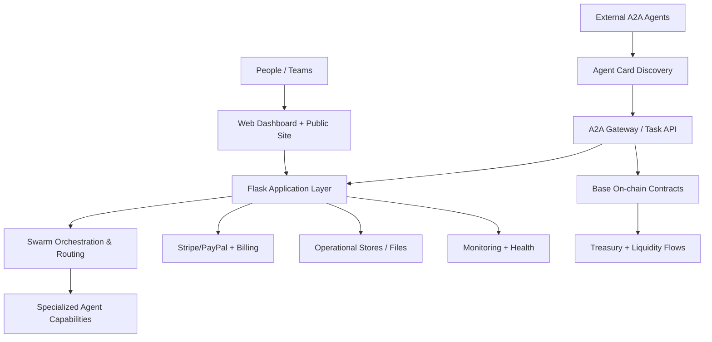
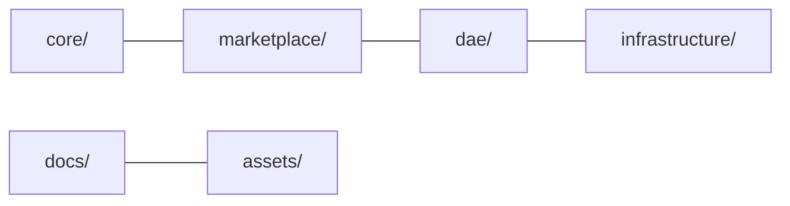

# SINCOR2 Architecture Overview (Transition Foundation)

## Purpose

This document establishes a high-level architecture baseline for transition planning toward maximum ecosystem scale.

## Current macro-architecture

## Transition target domains

- **core**: orchestration runtime, policy, reliability, execution controls.
- **marketplace**: Agent Cards, discovery, matching, settlement coordination.
- **dae**: incentive design, governance mechanisms, decentralized identity.
- **infrastructure**: deployment, operations, liquidity and treasury integrations.
- **docs/assets**: communication surface for contributors, operators, and partners.

## Scaling focus areas

1. Throughput and latency constraints in orchestration paths.
2. Protocol/version governance for external A2A clients.
3. Economic integrity: fees, incentives, and treasury sustainability.
4. Contributor throughput: clearer modular boundaries and ownership.
5. Observability depth across marketplace, orchestration, and economic layers.
