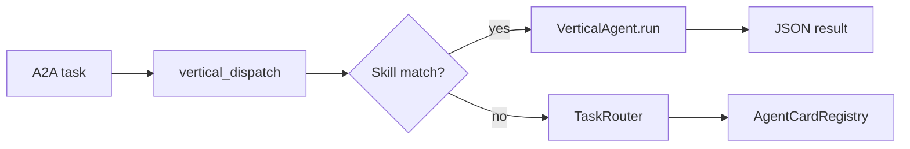

# Vertical Pack Integration Guide

This guide explains how SINCOR2 vertical agent packs connect to the live Flask runtime, A2A protocol, and marketplace discovery layer.

## Architecture



On startup, `bootstrap_platform()` in `src/sincor2/platform_bootstrap.py`:

1. Loads each `verticals/*/agent_card.json` into `AgentCardRegistry`
2. Instantiates all `VerticalAgent` subclasses
3. Extends the live A2A `SINCOR_SKILLS` catalogue from registered cards
4. Exposes state on `app.extensions['sincor_platform']`

## Marketplace API

| Endpoint | Purpose |
|---|---|
| `GET /api/marketplace/agents` | List registered Agent Cards |
| `GET /api/marketplace/agents/<id>` | Fetch a single card |
| `GET /api/marketplace/skills?q=` | Search skills by keyword |
| `GET /api/marketplace/verticals` | List live vertical agent instances |
| `GET /api/marketplace/routing/stats` | Task router load and history |

## Adding a new vertical pack

1. Create `verticals/<pack>/` with:
   - `agent.py` — subclass `VerticalAgent`
   - `schemas.py` — Pydantic input/output models
   - `agent_card.json` — A2A Agent Card with skill ids
   - `README.md` — domain documentation

2. Register the agent class in `verticals/loader.py`:
   - Add import and entry to `VERTICAL_AGENT_CLASSES`
   - Map skill ids in `SKILL_VERTICAL_MAP`

3. Add tests in `tests/pytest/test_platform_integration.py`

4. Restart the app — cards auto-register on bootstrap

## Invoking a vertical via A2A

Send a JSON-RPC `message/send` to `/api/a2a` with a registered skill id (e.g. `healthcare-rcm`) and JSON input:

```json
{
  "task_type": "eligibility_verification",
  "payload": { "patient_id": "P-12345" },
  "correlation_id": "req-001"
}
```

Plain-text input is also accepted; the dispatcher wraps it as `{ "task_type": "<skill_id>", "payload": { "input": "..." } }`.

## Skill id reference

| Skill id | Vertical agent |
|---|---|
| `healthcare-rcm` | HealthcareAgent |
| `provider-credentialing` | HealthcareAgent |
| `lead-enrichment` | LeadGenAgent |
| `trading-signals` | TradingAgent |
| `compliance-sbom` | ComplianceAgent |

See each pack's `agent_card.json` for the full skill catalogue.